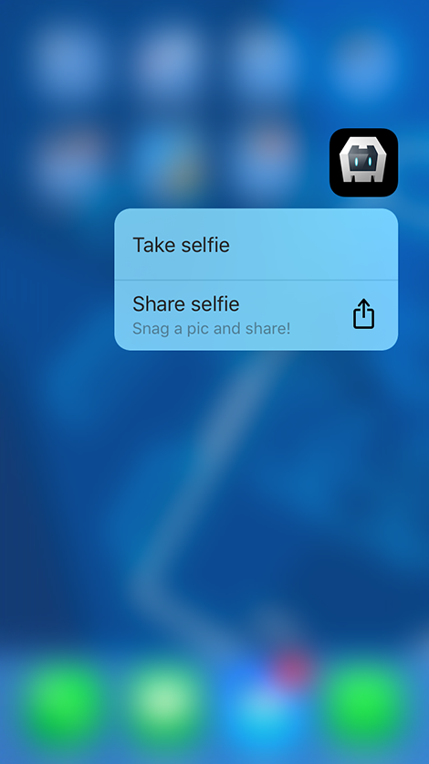
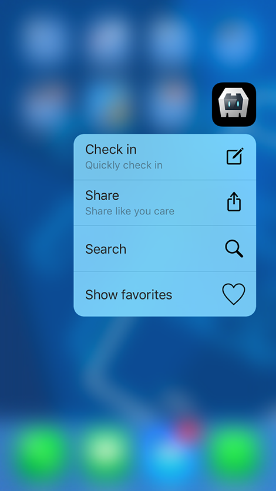
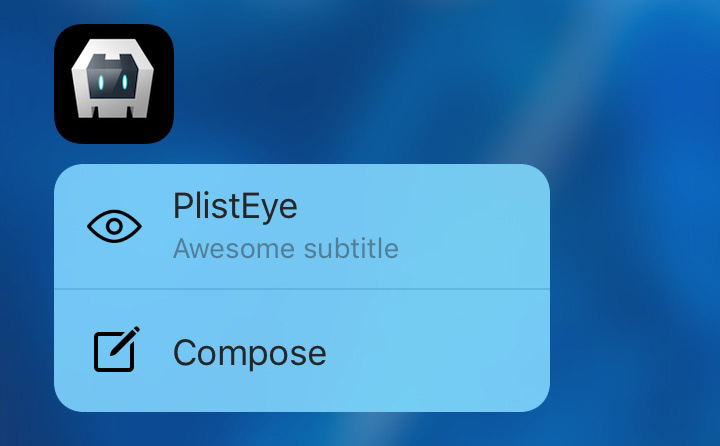

# 3D Touch Cordova plugin
by [Eddy Verbruggen](http://twitter.com/eddyverbruggen)

## 0. Index

1. [Description](#1-description)
2. [Screenshots](#2-screenshots)
3. [Installation](#3-installation)
4. [Usage](#4-usage)
5. [Static Home Icon Actions](#5-static-home-icon-actions)
6. [Changelog](#6-changelog)

## 1. Description

Add 3D Touch capabilities to your Cordova app:
* Quick Action for Home Screen icons. Static and Dynamic.
* Enable Link preview for external links.

## 2. Screenshots

&nbsp;
&nbsp;
&nbsp;

## 3. Installation

Latest stable version from npm:
```
$ cordova plugin add cordova-plugin-3dtouch
```

Bleeding edge version from Github:
```
$ cordova plugin add https://github.com/EddyVerbruggen/cordova-plugin-3dtouch
```

`ThreeDeeTouch.js` is brought in automatically.
It adds a global `ThreeDeeTouch` object which you can use to interact with the plugin.

## 4. Usage

Check the [demo code](demo/index.html) for all the tricks in the book, or read on for some copy-pasteable samples.

Make sure to wait for `deviceready` before using any of these functions.

Note that all these functions have optional callbacks, but mostly they're irrelevant,
except for the first function here:

### isAvailable
You need an iPhone 6S or some future tech to use the features of this plugin,
so you can check at runtime if the user's device is supported.

```js
  ThreeDeeTouch.isAvailable(function (avail) {
    // 'avail' is a boolean
    alert("avail? " + avail)
  });
```

### watchForceTouches
You can get a notification when the user force touches the webview.
The plugin defines a Force Touch when at least 75% of the maximum force is applied to the screen.
Your app will receive the x and y coordinates, so you have to figure out which UI element was touched.

Useful for context menu's, zooming in on images, whatnot.

```js
  ThreeDeeTouch.watchForceTouches(function(result) {
    console.log("force touch % " + result.force); // 84
    console.log("force touch timestamp " + result.timestamp); // 1449908744.706419
    console.log("force touch x coordinate " + result.x); // 213
    console.log("force touch y coordinate " + result.y); // 41
  });
```

You can also track in JS which was the last element that received an `ontouchstart` event,
remember the timestamp when that happened and correlate that to the timestamp of the force touch.
If those are very close to each other you can safely assume the force touch was on that element.

### configureQuickActions
When your app starts you can add those fancy Quick Actions to the Home Screen icon.
You can configure up to four icons and they are 'cached' until you pass in a new set of icons.
So you don't need to do this every time your app loads, but it can't really hurt.

There are two types of icons supported currently `iconType` and `iconTemplate`.

##### iconType
A value from a (case insensitive) fixed list of icons which have been provided by Apple and look great:
* iOS 9.0: Compose, Play, Pause, Add, Location, Search, Share
* iOS 9.1 added these: Prohibit, Contact, Home, MarkLocation, Favorite, Love, Cloud, Invitation, Confirmation, Mail, Message, Date, Time, CapturePhoto, CaptureVideo, Task, TaskCompleted, Alarm, Bookmark, Shuffle, Audio, Update

##### iconTemplate
Can be used to provide your own icon. It must be a valid name of an icon template in your Assets catalog.


The `type` param is the most convenient way to relate the icon to the event you'll receiver when
the icon was used to launch your app. So make sure it's unique amongst your icons.

```js
  ThreeDeeTouch.configureQuickActions([
    {
      type: 'checkin', // optional, but can be used in the onHomeIconPressed callback
      title: 'Check in', // mandatory
      subtitle: 'Quickly check in', // optional
      iconType: 'Compose' // optional
    },
    {
      type: 'share',
      title: 'Share',
      subtitle: 'Share like you care',
      iconType: 'Share'
    },
    {
      type: 'search',
      title: 'Search',
      iconType: 'Search'
    },
    {
      title: 'Show favorites',
      iconTemplate: 'HeartTemplate' // from Assets catalog
    }
  ]);
```

### onHomeIconPressed
When a home icon is pressed, your app launches and this JS callback is invoked. I found it worked
reliable when you use it like this (you should recognize the `type` params used previously):

```js
  document.addEventListener('deviceready', function () {
    ThreeDeeTouch.onHomeIconPressed = function (payload) {
      console.log("Icon pressed. Type: " + payload.type + ". Title: " + payload.title + ".");
      if (payload.type == 'checkin') {
        document.location = 'checkin.html';
      } else if (payload.type == 'share') {
        document.location = 'share.html';
      } else {
        // hook up any other icons you may have and do something awesome (e.g. launch the Camera UI, then share the image to Twitter)
        console.log(JSON.stringify(payload));
      }
    }
  }, false);
```

### enableLinkPreview
UIWebView and WKWebView (the webviews powering Cordova apps) don't allow the fancy new link preview feature
of iOS9. If you have a 3D Touch enabled device though, you sometimes are allowed to force press a link and a
preview pops up (see the screenshot above). If you want to enable this feature, do:
```js
  ThreeDeeTouch.enableLinkPreview();
```

### disableLinkPreview
To disable the link preview feature again, do:
```js
  ThreeDeeTouch.disableLinkPreview();
```

## 5. Static Home Icon Actions
The `configureQuickActions` function above can add dynamic icon actions to your app,
but what if you want to have actions immediately after installation from the AppStore, before opening your app?

That's where static icons come in, which need to be configured in your app's `.plist` file. Let's say you want these actions:



Then add this anywhere in the `.plist`:
```xml
	<key>UIApplicationShortcutItems</key>
	<array>
		<dict>
			<key>UIApplicationShortcutItemIconFile</key>
			<string>Eye</string>
			<key>UIApplicationShortcutItemTitle</key>
			<string>Eye from plist</string>
			<key>UIApplicationShortcutItemSubtitle</key>
			<string>Awesome subtitle</string>
			<key>UIApplicationShortcutItemType</key>
			<string>eyefromplist</string>
		</dict>
		<dict>
			<key>UIApplicationShortcutItemIconType</key>
			<string>UIApplicationShortcutIconTypeCompose</string>
			<key>UIApplicationShortcutItemTitle</key>
			<string>Compose</string>
			<key>UIApplicationShortcutItemType</key>
			<string>compose</string>
		</dict>
	</array>
```

#### UIApplicationShortcutItemIconFile
The second action uses the built-in `UIApplicationShortcutIconTypeCompose` icon
(which is the same as the `Compose` icon you'd get when using the `configureQuickActions`),
but the first one uses a custom icon: `Eye`. This expects an `Eye.png` file in your app's bundle.
According to Apple's docs this needs to be a single color square 35x35 icon, but that will look pixelated
on retina devices, so go ahead and use a 70x70 or 105x105 icon if you please.

In Xcode just drag the icon to the `Resources` folder. If you're using [Telerik Platform](https://platform.telerik.com)
you can add it to the `App_Resources/iOS` folder. That's where the `.plist` is stored as well.

#### UIApplicationShortcutItemTitle / UIApplicationShortcutItemSubtitle
You can guess what those do by looking at the screenshot, right?

Note that you can localize these by opening Xcode, and adding a `InfoPlist.strings` file to the `Resources` folder.
Then mark it as Localizable in the Utilities window and add translations for the appropriate languages. [Details here.](https://kb.applingua.com/2011/10/how-to-localize-app-names/)

If you're using Telerik Platform you can manually upload this plugin and tweak the plugin's contents.
See the commented section in `plugin.xml` about static icon localization.

#### UIApplicationShortcutItemType
This is the same as the `type` param of `configureQuickActions`, so it's what you'll receive in your
`onHomeIconPressed` as `payload.type`. Just do something cool with that info.

## 6. Changelog
* 1.3.5 Home icons are now WKWebView compatible. Previously your app would crash. See [#12](https://github.com/EddyVerbruggen/cordova-plugin-3dtouch/issues/12).
* 1.3.4 Increased the wait time for `onHomeIconPressed` from 5 to 15 secs. See [#4](https://github.com/EddyVerbruggen/cordova-plugin-3dtouch/issues/4).
* 1.3.3 Compatibility of 'home icon cold-starts' with [Meteor](https://www.meteor.com), see [#4](https://github.com/EddyVerbruggen/cordova-plugin-3dtouch/issues/4).
* 1.3.2 Compatibility with Cordova-iOS 4.
* 1.3.1 Added `timestamp` to the response of `watchForceTouches`.
* 1.3.0 You can now receive notifications when the user applies a 'Force Touch' on the webview.
* 1.2.2 Documentation on how to localize the title and subtitle of your static icons.
* 1.2.1 Documentation on how to add static icons to your app.
* 1.2.0 iOS 9.1 added a lot of new iconTypes to choose from. Thanks [#2](https://github.com/EddyVerbruggen/cordova-plugin-3dtouch/issues/2)!
* 1.1.0 Found a solid way to deal with timing when to call into `onHomeIconPressed`. Should always work now, even on coldstart.
* 1.0.1 Increased the timeouts a bit, so there is a better chance `onHomeIconPressed` gets called on coldstart. Thanks [#1](https://github.com/EddyVerbruggen/cordova-plugin-3dtouch/issues/1).
* 1.0.0 Initial release (untagged)
